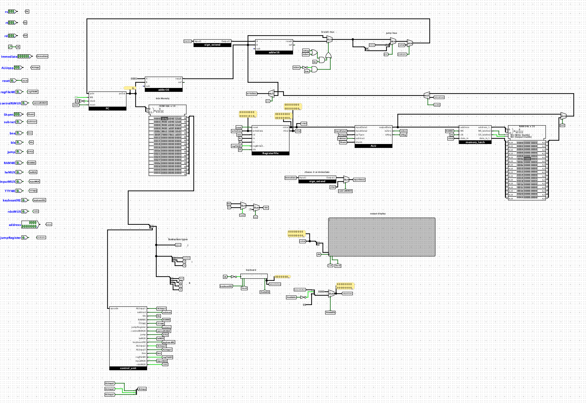

# CS250

CS250 is Duke's Computer Architecture class which introduces low level programming in C and MIPS assembly, CPU design, memory system design, data path design, caching, pipelining and some other topics. The purpose of these assignments is to focus on a specific topic and gain a hands on understanding of the subject. More information on this course taught in Fall 2023 can be found [https://people.ee.duke.edu/~jab/ece250/#syllabus](URL "here").

Project 1: Three simple C programs which introduce compiling C, debugging memory leaks with Valgrind, memory management and sorting.

Project 2: Rewriting the programs from Project 1 as assembly code using the MIPS instruction set. In addition to basic assembly, this focused on calling conventions and learning to run MIPS using QTSpim software.

Project 3: Boolean logic and designing a Moore finite state machine all the way down to individual gates. The first part was designing a 16-bit adder/subtractor and the second was designing a simple vending machine.

Project 4: This project was probably the most significant in the course, designing a functional CPU in logisim which implemented 16 instructions. The CPU is constructed entirely from basic circuitry (gates, RAM, ROM, d flip-flops, etc.). 

Project 5: Using Java, this project simulates a caching program, tracking hits and misses for various memory stores and loads. 
